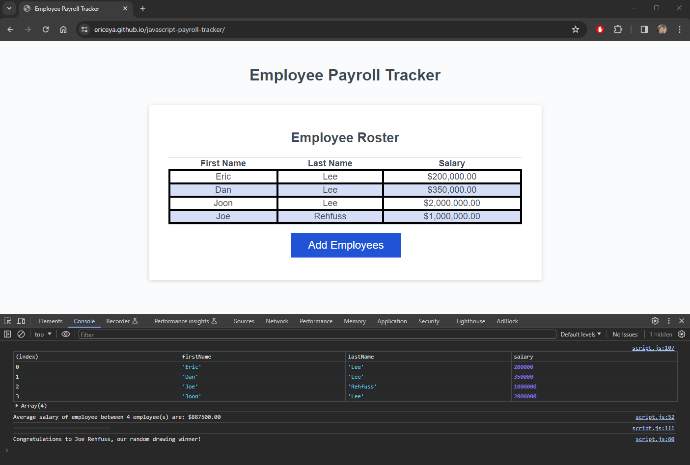

# Payroll Tracker using Javascript

With the javascript tools learned, code was debugged to properly take user input into object array for storing first/last name of the employee as well as the salary.

## Javascript functions used

- Creating a user input via `prompt()`
- Using `while () {}` loop to re-run a function as well as user input validation
- Using `for (){}` loop to access value in an object array for averaging the salary
- Using `Math.floor()` and `Math.random()` for random number generation and rounding to get correct number of employees
- Using `.toFixed()` to turn an average of salary into a floating number upto 2 decimal places.

## Screenshot of the deployed page

## Link to deploy

[Click here for deployed site](https://ericeya.github.io/javascript-payroll-tracker)